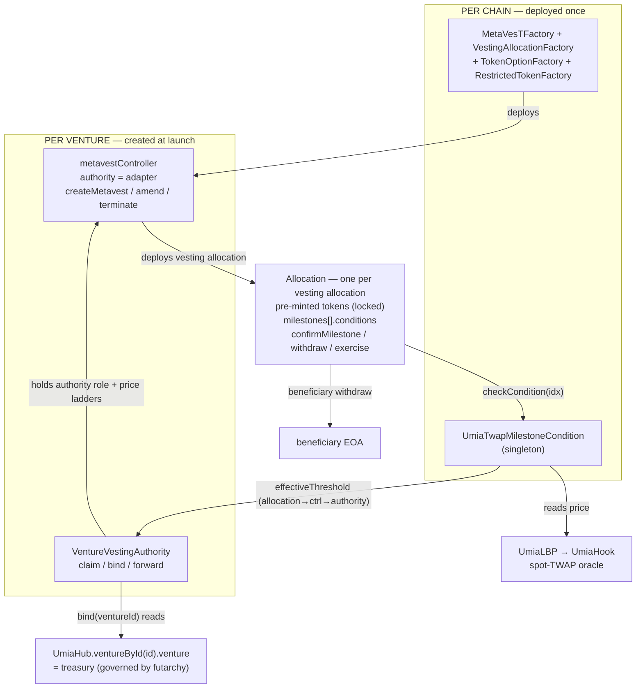
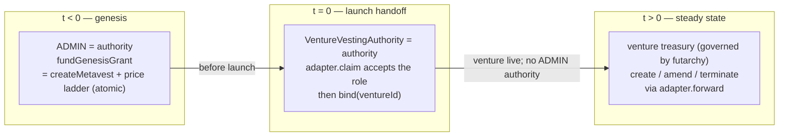
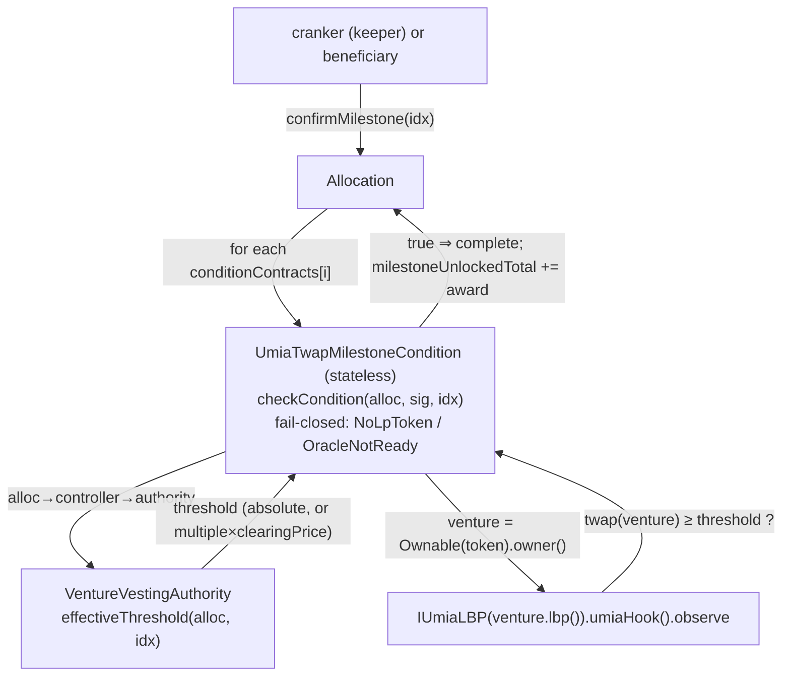
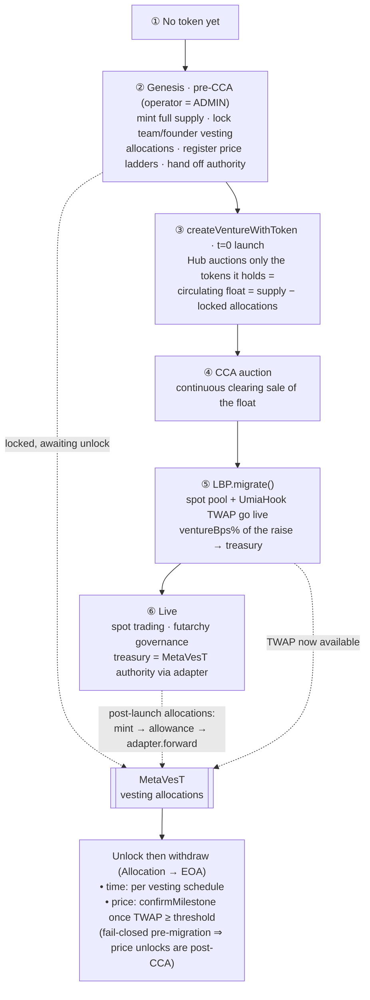
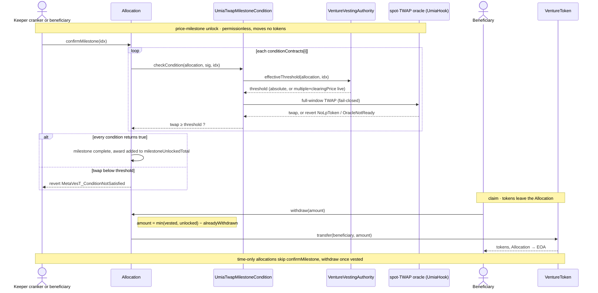

# MetaVesT Vesting Integration

How Umia uses MetaLeX [MetaVesT](https://github.com/MetaLex-Tech/MetaVesT) as the
canonical vesting / allocation layer for ventures.

Related docs: [`DEPLOY.md`](./DEPLOY.md) (deploying the singletons),
[`UmiaTwapMilestoneCondition`](../contracts/UmiaTwapMilestoneCondition.md) and
[`VentureVestingAuthority`](../contracts/VentureVestingAuthority.md) (contract references).

## Overview

A project can launch with pre-existing team and founder vesting allocations and run
two kinds of unlock schedule:

- **time-based** — linear vesting with cliffs, and
- **price-based** — release gated on the venture spot-pool TWAP crossing a threshold,

both funded from the venture treasury and governed after launch by futarchy.

The carve-out is **pure orchestration**. It adds exactly two Umia contracts —
`UmiaTwapMilestoneCondition` and `VentureVestingAuthority` — and makes **zero changes
to `UmiaHub` / `Venture`** (the adapter only reads the existing `ventureById` getter).
Everything else is MetaVesT (imported as a git submodule) wired together by the launch
orchestration and, after launch, by futarchy through the authority adapter.

Off-chain the integration also spans a vesting indexer, a milestone-cranker keeper job,
an API read layer, two CLI commands, and a hub vesting/treasury dashboard.

### Architecture at a glance



The condition is the only contract that touches the spot oracle.

## Key decisions

1. **MetaVesT is the single vesting engine.** Time unlocks use MetaVesT's native
   schedules; price unlocks use `UmiaTwapMilestoneCondition`, a MetaVesT
   `IConditionM` that reads the `UmiaHook` spot TWAP, fail-closed.
2. **Pre-mint + lock only.** MetaVesT cannot mint, so the full allocation is
   minted up front and locked in the allocation contract. Circulating-vs-total is
   surfaced in the hub for optics.
3. **Authority = venture treasury (futarchy) in steady state.** Genesis vesting
   allocations are created pre-t=0 by the launch operator, then the controller
   authority is handed to a per-venture `VentureVestingAuthority` adapter **before**
   `createVentureWithToken`. There is no post-launch bootstrap window and no seeded
   governance market.
4. **Pure orchestration, zero protocol changes.** Only the two new contracts; the
   adapter reads the existing `UmiaHub.ventureById(id)` getter.

## MetaVesT primitives

MetaVesT is pulled in as a git submodule at `lib/metavest` (AGPL-3.0), consumed via the
`@metavest/` remapping. The pieces the integration uses:

- **`MetaVesTFactory.deployMetavestAndController(authority, dao, vestingFactory,
  tokenOptionFactory, restrictedTokenFactory)`** → deploys one `metavestController`
  bound to a single `authority` (and optional `dao` for function-level conditions).
- **Three allocation types**, each deployed by the controller via its factory and
  holding pre-minted tokens:
  - `VestingAllocation` — linear vest + cliffs (`getVestingType() == 1`).
  - `TokenOptionAllocation` — exercise-priced (`== 2`).
  - `RestrictedTokenAward` — lapse / repurchase (`== 3`).
- **Allocation data** (read by the condition and the indexer):

  ```
  Allocation { uint256 tokenStreamTotal; uint128 vestingCliffCredit;
               uint128 unlockingCliffCredit; uint160 vestingRate;
               uint48 vestingStartTime; uint160 unlockRate;
               uint48 unlockStartTime; address tokenContract }
  Milestone  { uint256 milestoneAward; bool unlockOnCompletion; bool complete;
               address[] conditionContracts }
  getMetavestDetails() → Allocation        grantee() → address
  milestoneAwardTotal() milestoneUnlockedTotal()
  ```

- **Milestones.** Up to 20 per allocation. `confirmMilestone(idx)` is permissionless
  and completes a milestone only if **every** `conditionContracts[i]` returns true:

  ```
  IConditionM(c).checkCondition(address(this), msg.sig, abi.encodePacked(idx)) == true
  ```

  On completion, `milestoneAward` is added to `milestoneAwardTotal` and, if
  `unlockOnCompletion`, to `milestoneUnlockedTotal`.
- **Authority** creates/amends/terminates vesting allocations through the controller
  (gated by `onlyAuthority`); the optional **`dao`** can register function-level
  conditions.

The price condition plugs into a milestone's `conditionContracts` array.

## Dependency + shared singletons

MetaVesT is a git submodule at `lib/metavest` (from `MetaLex-Tech/MetaVesT`, AGPL-3.0),
consumed the same way as the repo's other `lib/` submodules (OpenZeppelin, Solady,
v4-core). The remapping `@metavest/=lib/metavest/src/` is declared in `foundry.toml`
and `remappings.txt`; the pinned version is the submodule reference tracked in the
parent repo, and `lib/` is excluded from compiler warnings
(`ignored_warnings_from = ["lib/"]`).

**Deployment topology:**

| Scope | Contracts | Created by |
| --- | --- | --- |
| Per chain (once) | `MetaVesTFactory`, the 3 allocation factories, `UmiaTwapMilestoneCondition` | deploy script ([`DEPLOY.md`](./DEPLOY.md)) |
| Per venture | `metavestController`, `VentureVestingAuthority` | launch orchestration |
| Per vesting allocation | an `Allocation` (Vesting / TokenOption / RestrictedToken) | `controller.createMetavest` |

The deploy script wires the per-chain singleton addresses into the config consumed by
the CLI and indexer.

## Authority model

The MetaVesT controller has a single `authority` that creates and amends vesting
allocations. The integration drives it in two phases.



- **Genesis (pre-t=0).** The launch operator (ADMIN) is the controller authority. It
  funds and creates the genesis vesting allocations and their price ladders in one call
  each (`fundGenesisGrant`, which forwards `createMetavest` and registers the ladder
  atomically). It then hands the authority role to the per-venture
  `VentureVestingAuthority` adapter **before** `createVentureWithToken` runs, closing
  any window in which ADMIN could mint or amend once the venture is live.
- **Steady state.** The controller authority is the adapter; the venture treasury
  (futarchy) drives it through `forward`. A passed proposal runs through the
  `GovernanceExecutor` (callable only by `UmiaMarketCore`), which drives the
  treasury's `onlyExecutor` entrypoints, and `Venture.executeCall(adapter, forward(…))`
  relays it — the adapter sees `msg.sender == treasury` and forwards to the controller
  as the authority. Post-launch vesting allocations, amendments, and terminations are
  governance proposals.

## `VentureVestingAuthority` adapter

A per-venture adapter that holds the controller `authority` role and routes it to the
treasury, **and is the per-allocation price-milestone registry** — a grant's price
ladder is written here in the same transaction as `createMetavest`, so grants and
ladders share one mutating path and one auth gate. Sketch:

```solidity
contract VentureVestingAuthority {
    enum PriceProgramKind { None, Absolute, Relative }
    struct PriceProgramInput {
        PriceProgramKind kind;
        uint160[] absoluteThresholds;  // kind == Absolute (Q96, moneyToken per ventureToken)
        uint256[] multiplesX1e6;       // kind == Relative (1e6 scale: 2x == 2_000_000)
    }

    address public immutable deployer;     // the launch operator; set in the constructor
    address public immutable hub;
    address public immutable controller;
    address public treasury;               // set once, in bind()
    bool    public bound;

    constructor(address hub_, address controller_);

    /// Accept the controller's pending-authority role (its two-step handoff). Permissionless:
    /// succeeds only if the controller already set this adapter as pending.
    function claim() external;              // controller.acceptAuthorityRole()

    /// Resolve the treasury from the Hub and lock it in, and grant the controller a standing
    /// allowance of the venture token so futarchy-funded grants can be pulled. Deployer-gated,
    /// write-once; the treasury comes from the Hub, never from caller input.
    function bind(uint256 ventureId) external {
        // require(msg.sender == deployer && !bound);
        // treasury = UmiaHub.ventureById(ventureId).venture;
        // IERC20(IVenture(treasury).token()).approve(controller, type(uint256).max);
    }

    /// Forward an authority call (createMetavest / amend / terminate) to the controller, and
    /// register the price ladder when the call is createMetavest. Gated to the bound treasury,
    /// so only futarchy can drive it. priceProgram.kind must be None for non-createMetavest calls.
    function forward(bytes calldata data, PriceProgramInput calldata priceProgram)
        external returns (bytes memory);    // controller's onlyAuthority sees address(this)

    /// The threshold the condition compares the TWAP against, resolved live:
    ///   Absolute → the stored Q96 threshold
    ///   Relative → multiple * cca().clearingPrice() / 1e6 (capped at uint160)
    /// Reverts NotRegistered (no program / idx out of range) or AuctionNotCleared.
    function effectiveThreshold(address allocation, uint256 idx) external view returns (uint160);

    /// The venture's auction, resolved live as IUmiaLBP(venture.lbp()).initializer().
    /// Zero before bind. No stored CCA — relative thresholds are lazy.
    function cca() external view returns (address);
}
```

- `bind` is deployer-gated and write-once, and resolves the treasury from
  `UmiaHub.ventureById(id).venture`, not from caller input — so ADMIN cannot redirect
  the adapter after handoff, and a stranger cannot front-run the bind to a different
  venture.
- **Funding.** `createMetavest` pulls a grant's tokens from the controller's
  `authority`, which is this adapter. So a post-launch grant is funded by transferring
  its tokens to the adapter; the standing allowance `bind` grants lets the controller
  pull them. The adapter never custodies tokens beyond the in-flight grant.
- **Atomic price ladder.** A grant's ladder (`PriceProgramInput`) is supplied to the
  same call that creates the grant (`fundGenesisGrant` at genesis, `forward`
  post-launch) and stored **write-once** per allocation. `kind == None` means no price
  milestones; a non-`None` ladder must be strictly ascending and non-zero, and may only
  ride a `createMetavest` call. The condition reads thresholds back via
  `effectiveThreshold`; there is no separate registration on the condition and no
  finalize step.
- **No stored CCA; lazy relative thresholds.** The adapter stores no auction reference.
  `cca()` resolves the venture's auction live (`venture.lbp().initializer()`), so a
  relative ladder's threshold is `multiple × clearingPrice` computed at read time and
  always reflects the current clearing price. `effectiveThreshold` reverts
  `AuctionNotCleared` while the venture is unbound or its clearing price is still 0.
- `forward` is the only mutating path post-launch and is gated to the treasury. A
  passed proposal reaches it through `Venture.executeCall`, whose outbound `msg.sender`
  is the Venture (= the bound treasury), so the gate holds.
- Reads the existing **`UmiaHub.ventureById(id)`** getter (`VentureInfo.venture` is the
  treasury); no protocol or launch-path change.

## Price unlocks: `UmiaTwapMilestoneCondition`

A shared singleton `IConditionM` that gates a milestone on the venture spot-pool TWAP.
Full detail: [`UmiaTwapMilestoneCondition`](../contracts/UmiaTwapMilestoneCondition.md).



- The condition holds **no state**: it stores nothing per allocation, has no owner or
  auth, and emits no events. The price ladder lives on the venture's adapter, written
  atomically with the grant.
- `checkCondition(allocation, sig, data)` decodes the milestone index from `data`
  (`abi.encode(uint256)`), resolves the threshold from the calling allocation's adapter
  (`allocation → controller → authority → effectiveThreshold(allocation, idx)`), and
  returns whether the current full-window TWAP meets it. The threshold is resolved
  first, so an unregistered or not-yet-cleared milestone surfaces the adapter's
  `NotRegistered` / `AuctionNotCleared` revert.
- Thresholds resolve **live**: an absolute ladder returns its stored Q96 value, a
  relative ladder returns `multiple × clearingPrice` against the venture's auction at
  read time. There is no anchoring or finalize step.
- The TWAP read is fail-closed — it reverts `NoLpToken` before the pool exists and
  `OracleNotReady` before the oracle can serve the full window, never degrading to a
  shorter window. The pool and its hook are resolved from the venture's
  `SpotLiquidityVault`; the token's venture from `VentureToken` ownership.

> ### ⚠️ Never mutate the milestone set of a price-gated grant after creation
>
> The milestone→threshold binding is **positional**. `confirmMilestone(i)` passes the array
> index `i` into `checkCondition`, which reads rung `i` from the write-once ladder on the
> adapter. The ladder is registered in lockstep at grant creation, so indices line up — but
> nothing keeps them aligned if the milestone array is later reordered. There is **no safe
> in-place mutation**:
>
> - **Removal fails open.** MetaVesT's `removeMetavestMilestone` deletes by swap-and-pop, so
>   removing any non-last milestone relocates the last (and, because registration enforces
>   ascending thresholds, highest-threshold) tranche onto a lower rung. That tranche becomes
>   confirmable at a cheaper price with a different or absent cliff — an unearned early unlock
>   of the largest award.
> - **Append fails closed.** `addMetavestMilestone` pushes past the ladder length, so
>   `effectiveThreshold`/`effectiveCliff` revert `NotRegistered` and that milestone can never
>   confirm — its award is locked in the allocation forever.
>
> The ladder is immutable (`ProgramAlreadyRegistered`), so neither can be corrected afterward.
>
> **Rule:** treat a price-gated grant's milestone set as frozen at creation. Do **not** build a
> governance payload that forwards `removeMetavestMilestone` or `addMetavestMilestone` for an
> allocation carrying a registered price program. If the set genuinely must change, **terminate
> and re-create** the grant — re-creation rebuilds the ladder in lockstep and is always correct.

## Lifecycle & orchestration

The whole cycle, from before a token exists to a live futarchy-governed venture, with
the MetaVesT touchpoints marked. Genesis vesting is set up **pre-CCA** (allocations are
carved out before the auction); **price** unlocks can only fire **post-CCA**, once
`migrate()` has stood up the spot pool and its TWAP.



### Token custody & money flow

The full supply is minted once, up front. Tokens then move only twice: into a vesting
allocation when it is funded (where they lock), and out of it when a beneficiary
withdraws. Nothing is minted on claim.

| Step | Held by | Trigger | Moves to |
| --- | --- | --- | --- |
| Mint | operator (genesis) / treasury (post-launch) | `VentureToken` mint | the funder |
| Fund a vesting allocation | funder → controller | `approve`, then `createMetavest` | its `Allocation` (locked) |
| Vest / unlock | the `Allocation` | time schedule + `confirmMilestone` | — (accounting only, no transfer) |
| Withdraw | the `Allocation` | `withdraw` / `exercise` / `claimRepurchased` | beneficiary EOA |

- **Where locked tokens live.** Each vesting allocation is one `Allocation` contract
  that custodies its entire award (`tokenStreamTotal + Σ milestoneAward`) for its
  lifetime. There is no shared vault; balances are per allocation.
- **Genesis funding.** The operator holds the full mint, `approve`s the adapter for
  `stream + Σ milestoneAwards` per vesting allocation, and
  `adapter.fundGenesisGrant(token, amount, createMetavestCalldata, priceProgram)`
  forwards `createMetavest` (which pulls exactly that into the freshly deployed
  `Allocation`) and registers the price ladder in the same call. By launch every genesis
  vesting allocation is funded, locked, and laddered, and authority is already handed off
  to the adapter.
- **Post-launch funding.** No operator. Futarchy `MINT_TOKENS` into the treasury (the
  `Venture`), transfers `total` to the adapter (the controller's authority), then
  `adapter.forward(createMetavest(…), priceProgram)` — the controller pulls from the
  adapter into the new `Allocation` and the ladder is registered atomically. Same end
  state: locked in an allocation.
- **Unlock ≠ transfer.** `confirmMilestone` and time vesting only advance the `vested` /
  `milestoneUnlockedTotal` counters; no tokens move. They stay in the `Allocation` until
  the beneficiary pulls them.
- **Withdraw.** The beneficiary calls the allocation directly; it sends
  `min(vested, unlocked) − alreadyWithdrawn` to the beneficiary EOA.

### Launch with vesting

`launch-with-vesting` runs, in order:

```
 1. deploy VentureToken (owner = operator), mint full supply to the operator
 2. controller = MetaVesTFactory.deployMetavestAndController(authority=ADMIN, dao=0, factories…)
 3. adapter = new VentureVestingAuthority(hub, controller)
 4. controller.initiateAuthorityUpdate(adapter); adapter.claim()   ── authority = adapter
 5. for each genesis vesting allocation:
       VentureToken.approve(adapter, stream + milestoneAwards)
       adapter.fundGenesisGrant(token, stream + milestoneAwards, createMetavestCalldata, priceProgram)
       └─ pulls stream + milestoneAwards from operator → the new Allocation (locked)
       └─ registers the price ladder atomically (priceProgram.kind == None if time-only)
       └─ emits AllocationFunded (+ PriceProgramRegistered if price-gated) for the indexer
 6. adapter.closeGenesis()
 7. VentureToken.transfer(hub, circulatingFloat); transferOwnership(hub)  ── float = supply − Σ(locked)
    createVentureWithToken({ token, … })                          ── Hub auctions the float; venture live
 8. adapter.bind(ventureId)                                        ── adapter routes to treasury
```

`createVentureWithToken` takes no float parameter; it auctions whatever balance the Hub
holds (`supply = balanceOf(hub)`), so the circulating float is set in step 7 — lock the
allocations first, then transfer only the remainder (and token ownership) to the Hub.
Each genesis grant carries its price ladder in the same `fundGenesisGrant` call
(step 5), so there is no separate ladder-registration step. Steps 3–6 must complete in
this order so every genesis grant routes through the adapter (and emits
`AllocationFunded`) before `closeGenesis` seals the window. Step 4 hands authority to
the adapter before any grants are funded, so the indexer can register the adapter via
`AuthorityUpdated` before `AllocationFunded` fires. The CLI emits a dry-run /
address-book for the whole sequence.

```mermaid
sequenceDiagram
    actor Op as Operator (ADMIN)
    participant Token as VentureToken
    participant Factory as MetaVesTFactory
    participant Ctrl as metavestController
    participant Alloc as Allocation
    participant Adapter as VentureVestingAuthority
    participant Hub as UmiaHub

    Note over Op,Token: 1 · mint the full supply up front
    Op->>Token: deploy, mint(fullSupply → Operator)

    Note over Op,Ctrl: 2 · deploy controller, authority = ADMIN
    Op->>Factory: deployMetavestAndController(authority=ADMIN, factories…)
    Factory->>Ctrl: deploy

    Note over Op,Adapter: 3–4 · deploy adapter + authority handoff, before grants
    Op->>Adapter: deploy VentureVestingAuthority(controller)
    Op->>Ctrl: initiateAuthorityUpdate(adapter)
    Op->>Adapter: claim()
    Adapter->>Ctrl: acceptAuthorityRole()
    Note over Ctrl: authority = adapter

    Note over Op,Adapter: 5 · fund each genesis grant via adapter → tokens LOCK + ladder, AllocationFunded
    loop each genesis vesting allocation
        Op->>Token: approve(adapter, stream + milestoneAwards)
        Op->>Adapter: fundGenesisGrant(token, amount, createMetavestCalldata, priceProgram)
        Adapter->>Ctrl: createMetavest(…)
        Ctrl->>Alloc: deploy
        Adapter-->>Adapter: register price ladder (write-once); emit AllocationFunded (+ PriceProgramRegistered)
    end
    Op->>Adapter: closeGenesis()

    Note over Op,Hub: 6 · hand the float to the Hub, then go live
    Op->>Token: transfer(Hub, float = supply − locked)
    Op->>Token: transferOwnership(Hub)
    Op->>Hub: createVentureWithToken(token)
    Note over Hub: auctions its whole balance to the LBP (= the float)

    Note over Op,Hub: 7 · bind adapter to the treasury
    Op->>Adapter: bind(ventureId)
    Adapter->>Hub: ventureById(ventureId).venture
    Hub-->>Adapter: treasury = the Venture
    Note over Adapter: forward() now gated to the treasury only
```

### Post-launch vesting allocations

`build-vesting-proposal` emits a governance `ExecutionPlanV1` whose actions are:

```
  MINT_TOKENS(total)                              // mint into the treasury (total = stream + Σ milestoneAwards)
  TRANSFER(VentureToken, adapter, total)          // move the grant's tokens to the adapter (the controller's authority)
  forward( controller.createMetavest(…), priceProgram )  // adapter.forward, gated to treasury; pulls adapter → Allocation
                                                  //   and registers the price ladder atomically (kind == None if time-only)
```

Each action runs as the treasury under the `GovernanceExecutor`: `MINT_TOKENS` via
`Venture.mint`, and the `TRANSFER` / `forward` via `Venture.executeCall` (both
`onlyExecutor`). The grant's tokens are transferred to the adapter rather than approved
to the controller, because `createMetavest` pulls from the controller's `authority` —
the adapter — whose standing allowance lets the controller pull them. The price ladder
rides the same `forward(createMetavest(…), priceProgram)` call, so there is no separate
ladder-registration action. Amendments and terminations are the corresponding
`forward(controller.update… / terminate…, None)` actions.

### Milestone confirmation

`confirmMilestone(idx)` is permissionless — beneficiaries can self-crank. The
`vesting-milestone-cranker` cron job is a convenience that watches price-gated
milestones and calls the keeper to confirm one once the condition's live
`checkCondition` passes (cron reads chain state, the keeper signs); it is idempotent and
skips already-confirmed milestones. The threshold it compares against is resolved live
onchain by the condition from the allocation's adapter — no stored or finalized
threshold value. Confirmation moves no tokens — it only flips `milestone.complete` and
adds the award to `milestoneUnlockedTotal`.

### Claiming

Beneficiaries withdraw vested + unlocked tokens directly from the allocation
(`withdraw` / `exercise` / `claimRepurchased`, per allocation type); tokens move
`Allocation → beneficiary EOA`. The amount is `min(vested, unlocked) − alreadyWithdrawn`,
where milestone awards add to both pools on confirmation.



### Configuration reference

One vesting allocation is one `createMetavest`, with its price ladder (if any) supplied
to the same funding call (`fundGenesisGrant` / `forward`). What to set:

- **Allocation** (`createMetavest(type, grantee, allocation, milestones, …)`):
  - `type` — 1 `VestingAllocation`, 2 `TokenOptionAllocation`, 3 `RestrictedTokenAward`.
  - `tokenStreamTotal` — the linearly-vesting amount; `vestingRate` / `vestingStartTime`
    / `vestingCliffCredit` shape its time schedule.
  - `unlockRate` / `unlockStartTime` / `unlockingCliffCredit` — the unlock schedule.
    Withdrawable is `min(vested, unlocked)`, so both schedules must clear.
  - `tokenContract` — the `VentureToken`.
- **Milestones** (`milestones[]`, ≤ 20): each `{ milestoneAward, unlockOnCompletion,
  conditionContracts }`. A price gate sets `conditionContracts =
  [UmiaTwapMilestoneCondition]`; the award counts toward `milestoneUnlockedTotal` only
  when `unlockOnCompletion` is set and every condition returns true.
- **Price ladder** (`PriceProgramInput`, supplied to `fundGenesisGrant` / `forward`): an
  ascending, non-zero ladder, written to the adapter in the same tx as the grant. Two
  kinds:
  - **Absolute** — a `uint160[]` of Q96 prices (moneyToken per `VentureToken`). Index
    `i` gates milestone index `i`; `confirmMilestone(i)` passes once the full-window
    TWAP ≥ `threshold[i]`.
  - **Relative** — a `uint256[]` of `1e6`-scaled multiples (2x == `2_000_000`). The
    threshold is resolved live as `multiple × clearingPrice` against the venture's
    auction, so no value is stored or anchored; `confirmMilestone(i)` passes once the
    TWAP ≥ that live threshold.

  `kind == None` for a time-only grant. The condition reads the resolved threshold from
  the adapter at check time.
- **Funding amount.** `approve` (genesis) or mint + allow (post-launch) exactly
  `tokenStreamTotal + Σ milestoneAward` for the vesting allocation; that is what
  `createMetavest` pulls and locks in the allocation.

## Backend & frontend

Off-chain the integration adds one indexer surface, a keeper cranker, a thin API read
layer, two CLI commands, and a hub dashboard. Addresses follow the repo convention:
lowercased everywhere on the indexer (`lc()`), checksum casing for display only.

### Deployment & config

The deploy script deploys the per-chain singletons once (`MetaVesTFactory`, the three
allocation factories, `UmiaTwapMilestoneCondition`) and writes their addresses into the
shared `contracts.json[env]` block the CLI and indexer read. The controller and adapter
are per-venture (not in the deploy script): emitted by `launch-with-vesting` and picked
up by the indexer at runtime. See [`DEPLOY.md`](./DEPLOY.md).

### Indexer

Envio. Controllers, their `VentureVestingAuthority` adapters, and allocations are
per-venture / per-vesting-allocation, so they are **auto-registered** at runtime
(`context.chain.<Template>.add(addr)`) rather than listed statically — the pattern
already used for `VentureTreasury` / `VentureToken`.

**Entities** (GraphQL `@entity`, chain-scoped `id`, lowercase addresses):

```graphql
type VestingController @entity {
  id: ID!                       # ${chainId}_${controllerAddress}
  chainId: Int! @index
  address: String! @index       # lc
  venture: Venture              # linked from the adapter's Bound event
  authority: String!            # lc — the adapter (or ADMIN pre-handoff)
  vestingAllocations: [VestingAllocation!]! @derivedFrom(field: "controller")
}
type VestingAllocation @entity {  # one per Allocation contract
  id: ID!                       # ${chainId}_${allocationAddress}
  controller: VestingController!
  allocation: String! @index    # lc
  token: String! @index         # lc VentureToken
  beneficiary: String! @index   # lc grantee
  allocationType: Int!          # 1 vesting / 2 option / 3 restricted
  streamTotal: BigInt!
  milestoneAwardTotal: BigInt!
  milestoneUnlockedTotal: BigInt!
  withdrawn: BigInt!
  milestones: [Milestone!]! @derivedFrom(field: "vestingAllocation")
  claims: [Claim!]! @derivedFrom(field: "vestingAllocation")
}
type Milestone @entity {
  id: ID!                       # ${chainId}_${allocationAddress}_${index}
  vestingAllocation: VestingAllocation!
  index: Int!
  award: BigInt!
  unlockOnCompletion: Boolean!
  complete: Boolean! @index
  priceGated: Boolean!          # set from PriceProgramRegistered; the live threshold is read onchain
}
type Claim @entity {            # a beneficiary withdraw / exercise / repurchase
  id: ID!                       # ${chainId}_${txHash}_${logIndex}
  vestingAllocation: VestingAllocation!
  beneficiary: String! @index   # lc
  amount: BigInt!
  kind: String!                 # withdraw | exercise | claimRepurchased
  blockTimestamp: BigInt!
}
type BeneficiaryTotal @entity { # per (chain, beneficiary) roll-up for the claim view
  id: ID!                       # ${chainId}_${beneficiary}
  beneficiary: String! @index   # lc
  totalAllocated: BigInt!
  totalWithdrawn: BigInt!
}
```

**Handlers** (`onEvent` from `src/lib/handler.ts`, every address through `lc()`):

- `MetaVesTFactory.MetaVesT_Deployment` → upsert the `VestingController` (records
  `authority`) and register the controller for its own events.
- `MetaVesTController.AuthorityUpdated` → update `VestingController.authority` (the
  genesis ADMIN → adapter handoff) and register the adapter for `AllocationFunded` /
  `Bound`.
- `VentureVestingAuthority.AllocationFunded` → upsert the `VestingAllocation` from the
  event payload (genesis via `fundGenesisGrant` and post-launch via
  `forward(createMetavest)`). This is the authoritative discovery signal for every grant
  — time-only and price-gated alike.
- `VentureVestingAuthority.PriceProgramRegistered` → flag the allocation's milestones
  `priceGated` (emitted in the same tx as `AllocationFunded`). The indexer stores **no
  threshold value** — the live threshold (absolute, or `multiple × clearingPrice`) is
  read onchain from the condition / adapter by the cranker and any UI. The condition
  itself is stateless and emits no events, so it is **not indexed**.
- `VentureVestingAuthority.Bound` and `UmiaHub.VentureCreated` → link `venture_id` on
  genesis allocations discovered before the venture existed (orphan rows matched by
  token).
- allocation lifecycle, **wildcard-indexed** (no per-allocation registration): withdraw
  → append a `Claim`, bump `VestingAllocation.withdrawn` + `BeneficiaryTotal.totalWithdrawn`;
  `MetaVesT_MilestoneCompleted` → set `Milestone.complete` + refresh the award/unlocked
  totals; `MetaVesT_Terminated` → flag the allocation terminated.

### API read layer

Hono + Drizzle, like the rest of `services/api`. The hub never hits the indexer
directly; the API fans the indexer's Hasura GraphQL (`queryIndexer`) into REST, joined
with vesting allocation metadata in its own Postgres (grantee display names / roles) and
cached in Redis. New read endpoints:

- `GET /ventures/:id/vesting` — vesting allocations for the venture: schedule, vested /
  unlocked / withdrawn, milestones (price-gated or not) with their live threshold read
  onchain from the adapter (`effectiveThreshold`) vs. the live TWAP.
- `GET /vesting/beneficiary/:address` — the vesting allocations a beneficiary can claim,
  with each one's withdrawable.
- `GET /ventures/:id/supply` — circulating vs. total (Σ locked allocations) for the
  optics panel.

Read-only: claiming is a direct onchain write from the hub.

### Keeper: vesting-milestone-cranker

Cron watches each open price-gated milestone and, when the condition's live
`checkCondition` passes (the full-window TWAP has reached the threshold the adapter
resolves for that index), calls the keeper to confirm it. The threshold is read onchain
(no stored or finalized value), so a relative ladder is evaluated against the current
clearing price automatically. Signing is keeper-only (cron never signs): a
`POST /keeper/v1/tx/confirm-milestone` route (keeper-secret auth) executes
`Allocation.confirmMilestone(idx)` with the per-chain signer, following the
`create-market` route pattern. Idempotent — it re-checks `complete` onchain before
sending, so a double-fire is a no-op. `confirmMilestone` is permissionless, so this is a
convenience: a beneficiary can self-crank from the hub if the keeper is down.

### CLI

Two `internal-cli` commands, each emitting a dry-run / address-book before sending:

- `launch-with-vesting` — runs the genesis sequence (token, controller, vesting
  allocations, ladders, authority handoff, `createVentureWithToken`, `bind`).
- `build-vesting-proposal` — emits the post-launch `ExecutionPlanV1` (mint → transfer →
  `adapter.forward(createMetavest, priceProgram)`, ladder included in the same action)
  for governance to pass.

### Hub / frontend

A vesting + treasury surface under the venture's hub project route (Next.js App Router).
Server components fetch the initial snapshot via `serverApi`; client components poll live
state with `useApiResources()` + react-query and read onchain balances with viem
(`useReadContract`). Three views:

- **Treasury / vesting dashboard** — per vesting allocation: schedule, vested / unlocked
  / claimed / withdrawable, and price tranches drawn against the live spot TWAP (each
  price-gated milestone's live threshold, read onchain from the adapter via
  `effectiveThreshold`, vs. the current `UmiaHook` reading). From
  `GET /ventures/:id/vesting`.
- **Beneficiary claim view** — a connected beneficiary sees their withdrawable and
  claims it. The withdraw is a direct onchain write via the Privy smart wallet
  (`walletClient.writeContract` → `Allocation.withdraw / exercise / claimRepurchased`),
  then the row refetches. Self-cranking a price milestone (`confirmMilestone`) is exposed
  here too (permissionless).
- **Circulating-vs-total supply panel** — the optics piece behind pre-mint + lock:
  `GET /ventures/:id/supply`, circulating vs. Σ locked allocations.

shadcn/ui components, `@umia/design` tokens; multi-chain by design (no hardcoded chain
names; the per-chain singleton addresses come from config).

## Non-goals

- **Mint-on-claim** — pre-mint + lock avoids custom just-in-time minting contracts and
  any `Venture` RBAC change.
- **Backward compatibility with `TwapUnlockVault`** — deleted; no deployment used it (its
  TWAP logic moved into the condition).
- **Forking MetaVesT** — imported as-is as a git submodule; upstream is used unmodified.

## Security considerations

- Fail-closed TWAP reads; never degrade to a shorter window.
- Write-once price ladders on the adapter; a wrong threshold cannot be silently
  overwritten, and the ladder shares the grant's single mutating path and auth gate
  (genesis deployer, then the bound treasury via `forward`).
- Relative thresholds resolve live from the venture's clearing price, so there is no
  anchoring / finalize transaction that could be skipped or front-run.
- The authority handoff completes **before** `createVentureWithToken`, so ADMIN holds no
  authority once the venture is live.
- `VentureVestingAuthority.forward` is gated to the Hub-resolved treasury; ADMIN cannot
  redirect it after `bind`.
- Pre-mint means the full allocation is real (locked) supply; the hub surfaces
  circulating-vs-total so the overhang is visible.

## Testing

The end-to-end lifecycle (genesis → price-milestone unlock → withdraw, plus the
authority-handoff-before-launch invariant and the post-launch governance path) lives in
`test/vesting/MetaVesTLifecycle.t.sol`, built on the `DecisionMarketBase` harness (real
venture + migrated pool + `UmiaHook.observe`). Contract-level unit and integration tests
sit alongside the `UmiaTwapMilestoneCondition` and `VentureVestingAuthority` sources;
indexer/API/hub tests follow the standard per-service patterns.
